# Customer Segmentation & Campaign Response Prediction

This project analyzes customer data to understand purchasing behavior, segment customers, and predict responses to future marketing campaigns. It leverages statistical and machine learning techniques to enable targeted, data-driven marketing that reduces churn and enhances campaign success.

## 📌 Problem Statement

In competitive markets, retaining customers is more cost-effective than acquiring new ones. However, mass marketing overlooks behavioral diversity. By mining customer demographics and behavior, this project enables more personalized campaign strategies that improve conversion and ROI.

## 🎯 Project Objectives

- Preprocess and clean raw customer data.
- Engineer new features to enrich customer profiles.
- Use PCA for dimensionality reduction.
- Segment customers using clustering techniques.
- Build predictive models to forecast campaign responses and spending.

## 🧠 Methodology

- **Data Source:** [Customer Personality Analysis Dataset on Kaggle](https://www.kaggle.com/datasets/imakash3011/customer-personality-analysis)
- **Preprocessing:** Imputation, encoding, feature engineering, scaling.
- **EDA:** Histograms, bar charts, correlation matrix, scatter and box plots.
- **Dimensionality Reduction:** PCA reduced 26 numeric features to 8 components.
- **Clustering:** Agglomerative clustering uncovered 4 distinct customer segments.
- **Modeling:**
  - `RandomForestClassifier` to predict promotion acceptance.
  - `LinearRegression` to predict total spending.

## 🔍 Key Results

- Identified 4 segments: Budget-Conscious Families, Young Singles, Premium Buyers, Digitally Active Families.
- Random Forest improved minority-class recall to 61% (F1 = 0.866, AUC = 0.867).
- Linear Regression achieved R² = 0.941 (log-transformed target) for spend prediction.
- Visuals confirm well-separated clusters and spending behaviors across categories.

## 📊 Visualizations

Key visual insights generated during the analysis are stored in the [`plots/`](plots/) directory:

| Plot                                          | Description                                                    |
| --------------------------------------------- | -------------------------------------------------------------- |
|            | Correlation heatmap to explore relationships between features. |
| 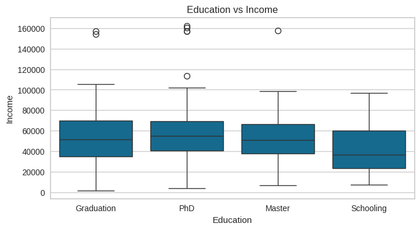                       | Box plot to detect outliers and understand distribution.       |
| 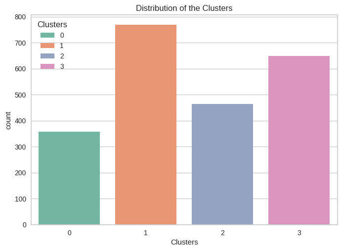       | Cluster-wise distribution showing segment sizes.               |
| 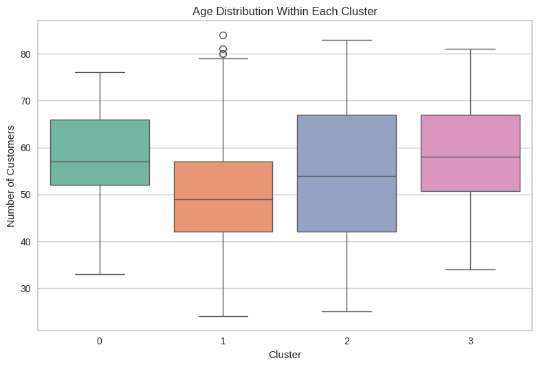    | Age variation across customer segments.                        |
| 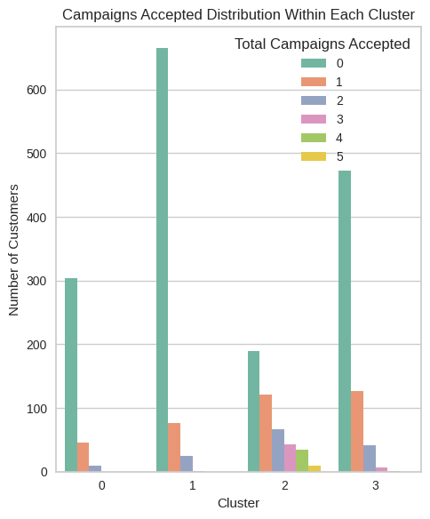 | Campaign acceptance patterns across clusters.                  |
|           | Education levels per segment.                                  |
| 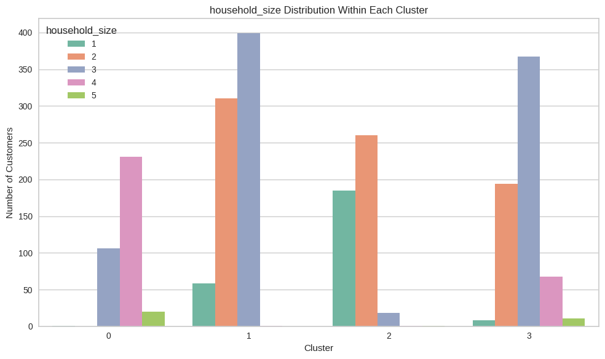      | Household size comparison among clusters.                      |
| 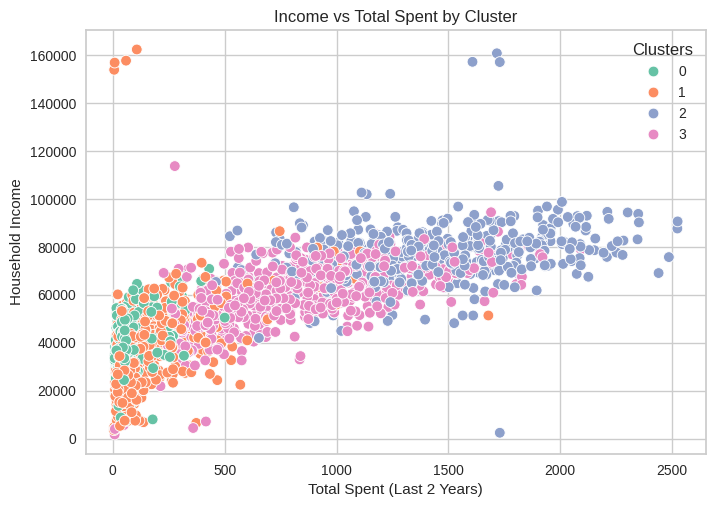          | Relationship between income and total spending.                |
| 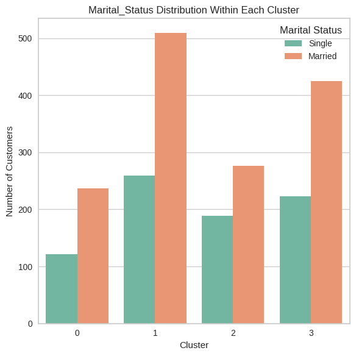      | Marital status distribution by customer group.                 |
| 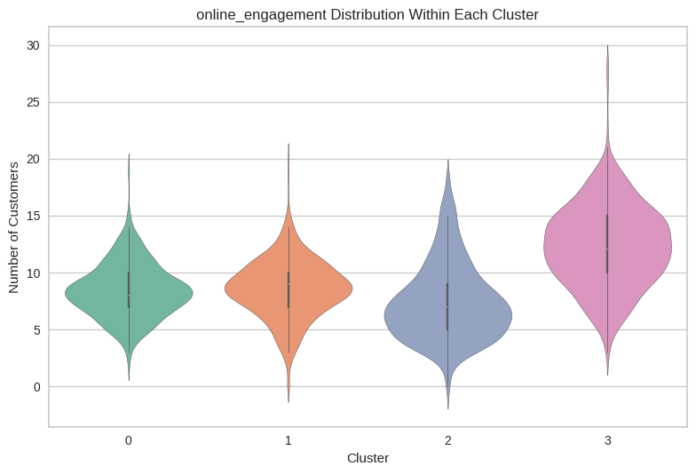   | Digital activity variation per segment.                        |
|              | Imbalanced target visualization before SMOTE.                  |
| 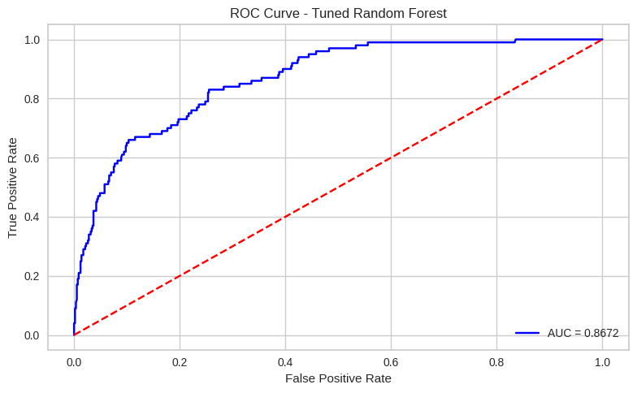                            | ROC curve for classifier performance.                          |
| 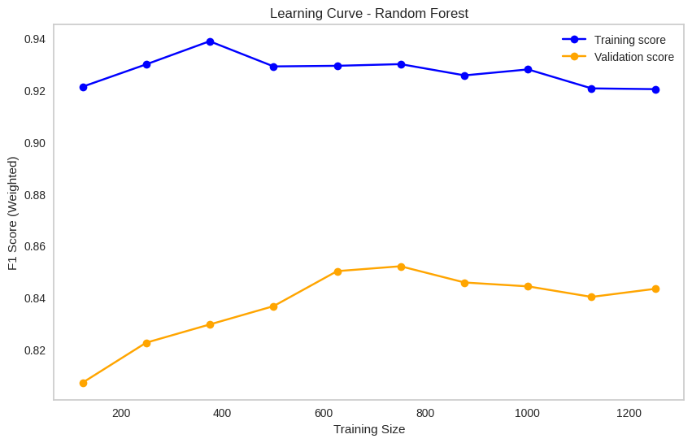              | Learning curve of the Random Forest classifier.                |
| 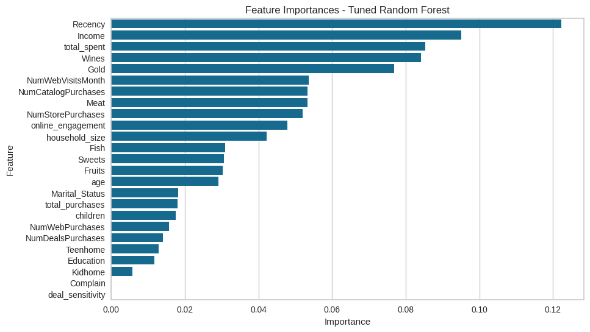          | Top features identified by Random Forest.                      |
| 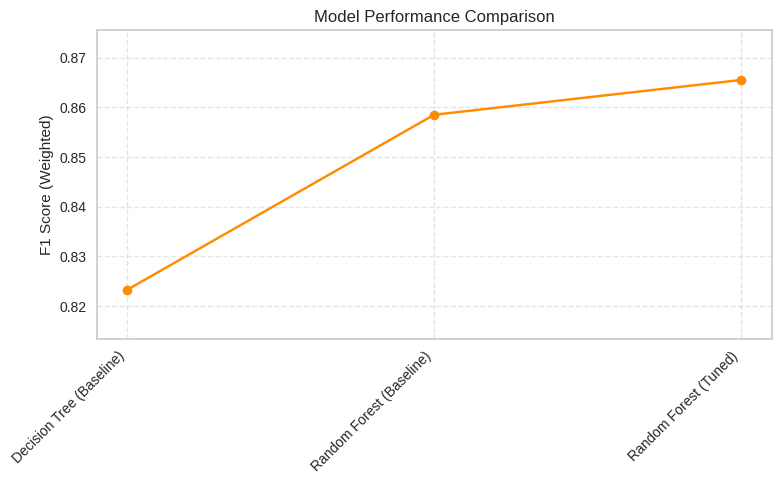   | Comparison of multiple model performances.                     |

## 🛠️ Tech Stack

- Python
- pandas, scikit-learn, matplotlib, seaborn
- Altair (for interactive bar charts)
- Jupyter Notebook

## 📁 Project Structure

```text
customer-segmentation/
├── data/
│   └── marketing_campaign.csv
├── notebooks/
│   └── Customer_Personality_Analysis.ipynb
├── plots/
│   ├── correlation_matrix.png
│   ├── pca_scatter.png
│   └── ...
└── README.md
```
